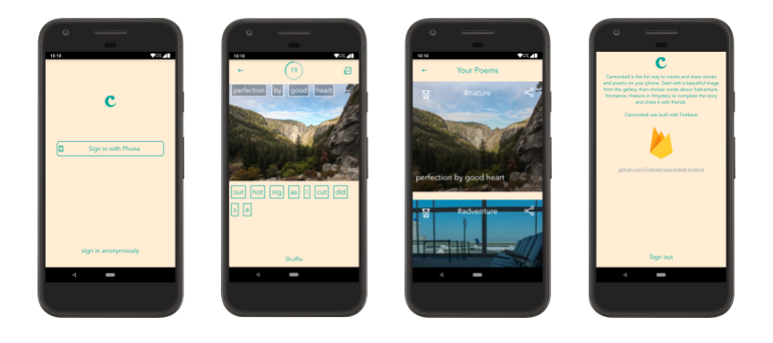

# Cannonball for Android

Cannonball is the fun way to create and share stories and poems on your phone. Start with a beautiful image from the gallery, then choose words about #adventure, #romance, #nature or #mystery to complete the story and share it with friends.

## Introduction

This repository contains the source code for Cannonball, an Android application written in Java built with [Firebase](https://firebase.google.com/).

Cannonball is a canonical sample Android app to demonstrate how to use [Firebase](https://firebase.google.com/), the easiest way to build the best apps.

Cannonball uses many of the features available in Firebase, including Realtime Database, Crashlytics, Google Analytics for Firebase, and Firebase Auth.

## Screenshots

## Support

If you've found an error in this sample, please file an issue.

Patches are encouraged, and may be submitted by forking this project and
submitting a pull request through GitHub.

### Prerequisites

This project uses Gradle 4.4

To get started and run the app, you need to follow these simple steps:

1. Clone this repo via command line (`git clone https://github.com/Firebase/cannonball-android/`) or [Android Studio](https://stackoverflow.com/a/16597664/4816918)
1. Run "Sync Project with Gradle Files" via [command line](https://developer.android.com/studio/build/building-cmdline) or [Android Studio](https://stackoverflow.com/a/29565362/4816918)
1. If you don't already have a Firebase account, sign up for Firebase at [firebase.google.com](https://firebase.google.com/)
1. Follow the instructions to [add Firebase to your Android app](https://firebase.google.com/docs/android/setup#add_firebase_to_your_app)
1. Enable [Phone Sign-In](https://firebase.google.com/docs/auth/android/phone-auth) and [Anonymous Sign-In](https://firebase.google.com/docs/auth/android/anonymous-auth)

## Compatibility

Cannonball for Android is compatible with Android SDK version 17+.

## Contributors

* [Luis Cipriani](https://twitter.com/lfcipriani)
* [Gareth Jones](https://twitter.com/gpj)
* [Israel Camacho](https://twitter.com/rallat)
* [Ty Smith](https://twitter.com/tsmith)
* [Lien Mamitsuka](https://twitter.com/lientm)
* [Andre Pinter](https://twitter.com/ndform)
* [Chris Aniszczyk](https://twitter.com/cra)
* [Eric Frohnhoefer](https://twitter.com/ericfrohnhoefer)
* [Michael Furtak](https://twitter.com/MikeFurtak)
* [Steve Wilber](http://twitter.com/stevewilber)
* [Dalton Hubble](https://twitter.com/dghubble)
* [Jeff Huleatt](https://github.com/jhuleatt)

## License

See [LICENSE](LICENSE)
